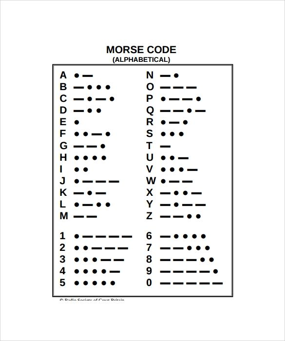
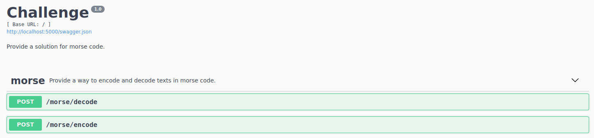
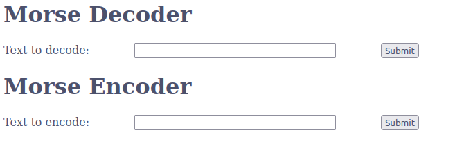

# Morse Code Translator

## Description
The project was created to solve the challenge of creating a morse code encoder and decoder.
The brackend part was done using Python with Flask and the frontend was done in a simple way using a nodejs server.




## How to run
In the root folder of the project directory run:
```sh
docker-compose up --build
```

Then the Flask API will be on local port 5000 with swagger:


And the nodejs server will be ready for use on port 8080.


## How to run the tests
To run the tests you just need to install Python 3.8.10 in a virtual environment and the libraries that are in the requirements:
```sh
pip install -r requirements.txt
```
And then run the tests:
```sh
pytest test/
```